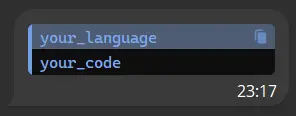

# Common Questions

## Which aiogram version should I use?

Aiogram 2.x is essentially outdated at this point. While it can still be used, it lacks support for the latest TelegramBotApi versions. Understanding Aiogram 2.x may be necessary to maintain older projects, but aside from that, there's little reason to begin learning it now. It's advisable to start with the most recent version.

## Where should I start from?

Try the [Simple Usage](https://docs.aiogram.dev/en/latest/#simple-usage) example from the documentation.

## Can my bot use premium emojis?

Yes, but it [requires buying a custom Fragment username](https://stackoverflow.com/questions/74437942/how-to-send-custom-emoji-from-bot-in-telegram/76853897#76853897) for 5000 TON ($12k at the time of the acticle's creation).

## Can two of my bots communicate?

Short answer is [no](https://core.telegram.org/bots/faq#why-doesn-39t-my-bot-see-messages-from-other-bots).

However, you can establish their communication through third-party software, as they cannot directly see each other's messages on Telegram.

## Text formatting

There are different ways to format your text. You can either use plain [markdown](https://core.telegram.org/bots/api#markdownv2-style)/[html](https://core.telegram.org/bots/api#html-style) syntax in your messages, or use aiogram's in-built methods. I recommend the second option, because it is more reliable, as it unparses your strings before applying styles.

You need to import the desired module using:

```python
from aiogram import html
```

or

```python
from aiogram import md
```

All of the methods available you can check [here](https://github.com/aiogram/aiogram/blob/acf52f468cae79b3511c2939cf39a801fa47f9f3/aiogram/utils/text_decorations.py#L127-L173).

### Bad Request: can't parse entities

If you are gettin the following error:

```txt
exception=TelegramBadRequest('Telegram server says - Bad Request: can't parse entities: Unsupported start tag "<1;</code" at byte offset 59')>
```

chances are that your text contains special characters, that cannot be parsed (for example, "<" or ">" in html parse mode).

If your code looks something like that `html.bold(user_fullname)` you should change it to `html.bold(html.unparse(your_text))`.

!!! note "There is another way"
    You can use aiogram formatting classes directly instead of using the unparse method. In that case your code will look a bit different (arguably more complex).

```python
from aiogram.utils.formatting import Bold

@router.message(Command("bold"))
async def test_command(message: Message):
    bold = Bold(your_text)
    await message.answer(**bold.as_kwargs())
```

<sub>*example by* [Avazart](https://t.me/Avazart)</sub>

### How can I send code blocks?

If you use HTML parse mode:

```python
await message.answer(html.pre_language(value="your_code", language="language_name"))
```

In case of working with Markdown:

```python
await message.answer(md.pre_language(value="your_code", language="language_name"))
```

**Output:**



## Can my bot handle offline messages?

As the [Telegram Bot API documentation](https://core.telegram.org/bots/api#getting-updates) states:

> There are two mutually exclusive ways of receiving updates for your bot - the getUpdates method on one hand and webhooks on the other. Incoming updates are stored on the server until the bot receives them either way, but they will not be kept longer than 24 hours.

In case of working with polling you can call the `getUpdates()` (for example, use can add `await bot.get_updates()` in the startup function) method to retrieve all the missed messages.

If you have a webhook - configure it while setting up:

```python
await bot.set_webhook(..., drop_pending_updates=False)
```

## Can my bot set FSM states for a group?

Yes, there are [5 types of FSM strategies](https://github.com/aiogram/aiogram/blob/acf52f468cae79b3511c2939cf39a801fa47f9f3/aiogram/fsm/strategy.py#L5-L10). Dispatcher has a `fsm_strategy` parameter, which by default is set to `FSMStrategy.USER_IN_CHAT`. You can change it when creating your Dispatcher instance.

```python
from aiogram.fsm.strategy import FSMStrategy

...

dp = Dispatcher(fsm_strategy=FSMStrategy.CHAT)
```

## Does aiogram support Telegram Bot API 7.2?

The [7.2 update](https://core.telegram.org/bots/api#march-31-2024) introduced integration with business accounts but also caused issues with sticker packs.

Aiogram developers are currently working on updating compatibility, and you can already test a [GitHub draft](https://github.com/aiogram/aiogram/tree/feature/bot-api-7.2) with basic support for Bot API 7.2.

!!! warning "Keep in mind that this update is not yet fully released"
    If you're comfortable with Git and have a good understanding of the aiogram source code, you can try it out. Bonus points for finding and fixing bugs.
    However, if this sounds unfamiliar to you, it's best to wait for the official release.

## How can I handle media groups/albums?

Aiogram doesn't have in-built methods for it, but you can use [aiogram_album](https://github.com/RootShinobi/aiogram_album) utility by an active aiogram community member.
